<div align="center">

```
   ___    ____   ____  ____  ______   ___   _____ _____ ____ _____ _____ ___   _   _ _____ 
  / _ \  |_ _| |  _ \|  _ \|  ____| / _ \ / ____/ ____|_   _/ ____|_   _/ _ \ | \ | |_   _|
 / /_\ \  | |  | |_) | | | | |__   / /_\ \| (___| (___   | | \___ \ | || |_| ||  \| | | |  
|  _  |  | |  |  __/| | | |  __|  |  _  | \___ \\___ \  | |  ___) || ||  _  || . ` | | |  
| | | | _| |_ | |   | |_| | |     | | | | ____) |___) |_| |_|____/ | || | | || |\  | | |  
|_| |_||_____||_|   |____/|_|     |_| |_||_____/_____/|_____|_____/ |_||_| |_||_| \_| |_|  
                                                                                            
            🤖 Next Generation Document Intelligence with AI 🚀
```

<p align="center">
  
  
  
  
</p>

<p align="center">
  
  
  
  
</p>

<h3 align="center">
  <a href="#-key-features">Features</a> •
  <a href="#-quick-start">Quick Start</a> •
  <a href="#-demo">Demo</a> •
  <a href="#-documentation">Docs</a> •
  <a href="#-contributing">Contributing</a>
</h3>

<p align="center">
  <strong>Transform your PDF documents into an intelligent conversational experience!</strong><br>
  Upload, Ask, and Get Instant AI-Powered Answers from Your Documents
</p>

</div>

---

## 🌟 What is AI PDF Assistant?

**AI PDF Assistant** is a cutting-edge desktop application that revolutionizes how you interact with PDF documents. Using state-of-the-art **Retrieval-Augmented Generation (RAG)** technology, it allows you to have natural conversations with your documents, extracting insights and answers in seconds.

<div align="center">

### 🎯 **Why Choose AI PDF Assistant?**

| 🎨 Beautiful UI | 🧠 Smart AI | ⚡ Lightning Fast | 🔒 Privacy First |
|:---:|:---:|:---:|:---:|
| Modern gradient interface with smooth animations | Powered by Mistral LLM & advanced embeddings | Optimized vector search with FAISS | 100% local processing, your data stays private |

</div>

---

## ✨ Key Features

<table>
<tr>
<td width="50%">

### 🎨 **Stunning User Interface**
```
✓ Gradient backgrounds
✓ Custom hover effects
✓ Smooth animations
✓ Chat bubble design
✓ Responsive layout
✓ Modern typography
```

</td>
<td width="50%">

### 🤖 **Advanced AI Engine**
```
✓ RAG architecture
✓ Mistral LLM integration
✓ Semantic search
✓ Context-aware responses
✓ Multi-document support
✓ Smart chunking
```

</td>
</tr>
<tr>
<td width="50%">

### 📄 **Document Processing**
```
✓ Multi-PDF upload (up to 10)
✓ Automatic text extraction
✓ Intelligent chunking
✓ Memory optimization
✓ Error handling
✓ Progress tracking
```

</td>
<td width="50%">

### 🚀 **Performance & Safety**
```
✓ Async operations
✓ Thread-safe design
✓ Memory limits
✓ Error recovery
✓ Real-time feedback
✓ Crash prevention
```

</td>
</tr>
</table>

---

## 🎬 Demo

<div align="center">

### 📸 Application Screenshots

<!-- Add your screenshots here -->


<p><i>Beautiful gradient interface with modern chat bubbles</i></p>

</div>

<details>
<summary>📹 <b>Click to see more screenshots</b></summary>

<br>

<div align="center">

**PDF Upload Process**


**AI Response Example**


</div>

</details>

---

## 🛠️ Tech Stack

```mermaid
graph LR
    A[📄 PDF Files] --> B[PyPDF Loader]
    B --> C[Text Splitter]
    C --> D[HuggingFace Embeddings]
    D --> E[FAISS Vector Store]
    F[👤 User Query] --> E
    E --> G[Retriever]
    G --> H[Mistral LLM]
    H --> I[💬 AI Response]
    
    style A fill:#FFE5B4
    style I fill:#B4FFB4
    style H fill:#FFB4B4
    style E fill:#B4E5FF
```

<div align="center">



</div>

<table align="center">
<tr>
<th>Category</th>
<th>Technology</th>
<th>Purpose</th>
</tr>
<tr>
<td>🎨 <b>Frontend</b></td>
<td>Tkinter + Custom Widgets</td>
<td>Beautiful, responsive GUI</td>
</tr>
<tr>
<td>🧠 <b>AI Model</b></td>
<td>Mistral (via Ollama)</td>
<td>Natural language understanding</td>
</tr>
<tr>
<td>🔍 <b>Embeddings</b></td>
<td>HuggingFace Transformers</td>
<td>Semantic text representation</td>
</tr>
<tr>
<td>💾 <b>Vector DB</b></td>
<td>FAISS</td>
<td>Fast similarity search</td>
</tr>
<tr>
<td>📚 <b>Framework</b></td>
<td>LangChain</td>
<td>RAG orchestration</td>
</tr>
<tr>
<td>📄 <b>PDF Parser</b></td>
<td>PyPDF</td>
<td>Document text extraction</td>
</tr>
<tr>
<td>⚙️ <b>Backend</b></td>
<td>Python 3.8+</td>
<td>Core application logic</td>
</tr>
</table>

---

## 🚀 Quick Start

### 📋 Prerequisites

<table>
<tr>
<td width="50%">

**Required Software:**
- ✅ Python 3.8 or higher
- ✅ Ollama with Mistral model
- ✅ Git (for cloning)

</td>
<td width="50%">

**Check Your Setup:**
```bash
# Verify Python
python --version

# Verify Ollama
ollama list
```

</td>
</tr>
</table>

### 📥 Installation

<details open>
<summary><b>🪟 Windows</b></summary>

```powershell
# 1. Clone the repository
git clone https://github.com/yourusername/ai-pdf-assistant.git
cd ai-pdf-assistant

# 2. Create virtual environment
python -m venv venv
venv\Scripts\activate

# 3. Install dependencies
pip install -r requirements.txt

# 4. Install Ollama & Mistral
# Download from https://ollama.ai
ollama pull mistral

# 5. Run the application
python main.py
```

</details>

<details>
<summary><b>🐧 Linux / 🍎 macOS</b></summary>

```bash
# 1. Clone the repository
git clone https://github.com/yourusername/ai-pdf-assistant.git
cd ai-pdf-assistant

# 2. Create virtual environment
python3 -m venv venv
source venv/bin/activate

# 3. Install dependencies
pip install -r requirements.txt

# 4. Install Ollama & Mistral
curl -fsSL https://ollama.ai/install.sh | sh
ollama pull mistral

# 5. Run the application
python main.py
```

</details>

---

## 💡 Usage Guide

### 🎯 Getting Started

<table>
<tr>
<td width="5%">1️⃣</td>
<td width="95%">

**Launch the Application**
```bash
python main.py
```
The beautiful gradient interface will appear with a welcome message.

</td>
</tr>
<tr>
<td>2️⃣</td>
<td>

**Upload Your PDFs**
- Click the **📤 Upload PDF** button in the top-right corner
- Select one or more PDF files (maximum 10)
- Wait for the ✅ success confirmation

</td>
</tr>
<tr>
<td>3️⃣</td>
<td>

**Ask Questions**
- Type your question in the input box at the bottom
- Press **Enter** or click **🚀 Send**
- Watch the AI analyze and respond!

</td>
</tr>
</table>

### 💬 Example Conversations

<details>
<summary><b>📊 Research Paper Analysis</b></summary>

```
You: What is the main hypothesis of this research paper?

AI: Based on the uploaded document, the main hypothesis is that 
    machine learning models can improve prediction accuracy by 
    incorporating temporal features...
```

</details>

<details>
<summary><b>📈 Business Report Insights</b></summary>

```
You: Summarize the Q4 financial results

AI: The Q4 financial results show:
    • Revenue increased by 23% YoY
    • Net profit margin improved to 18.5%
    • Customer acquisition cost decreased by 12%
```

</details>

<details>
<summary><b>📚 Academic Study</b></summary>

```
You: List all the key findings mentioned in Chapter 3

AI: Chapter 3 presents the following key findings:
    1. Temperature variations affect crop yield by 15-20%
    2. Soil moisture levels correlate with productivity...
```

</details>

### ⌨️ Keyboard Shortcuts

| Shortcut | Action |
|----------|--------|
| `Enter` | Send message |
| `Shift + Enter` | New line in message |
| `Ctrl + O` | Upload PDF (coming soon) |

---

## 📁 Project Structure

```
📦 ai-pdf-assistant/
│
├── 📄 main.py                 # Main GUI application with Tkinter
├── 🧠 rag_backend.py          # RAG processing & AI logic
├── 📋 requirements.txt        # Python dependencies
├── 📖 README.md              # This beautiful file!
│
├── 📂 venv/                  # Virtual environment (gitignored)
├── 📂 __pycache__/           # Python cache (gitignored)
└── 📂 .git/                  # Git repository
```

---

## ⚙️ Configuration

### 🎛️ Customize AI Behavior

<details>
<summary><b>Change LLM Model</b></summary>

Edit `rag_backend.py`:

```python
llm = OllamaLLM(
    model="mistral",        # Try: llama2, codellama, neural-chat
    temperature=0.2         # 0.0 = focused, 1.0 = creative
)
```

</details>

<details>
<summary><b>Adjust Document Processing</b></summary>

```python
splitter = RecursiveCharacterTextSplitter(
    chunk_size=800,         # Larger = more context, slower
    chunk_overlap=120       # Overlap prevents context loss
)
```

</details>

<details>
<summary><b>Modify PDF Limits</b></summary>

```python
MAX_FILES = 10              # Maximum number of PDFs
MAX_CHUNKS = 4000          # Maximum chunks per document
```

</details>

---

## 🔧 Troubleshooting

<details>
<summary><b>❌ Ollama Connection Error</b></summary>

**Problem:**
```
Error: Could not connect to Ollama
```

**Solutions:**
1. Start Ollama service:
   ```bash
   ollama serve
   ```
2. Verify Mistral is installed:
   ```bash
   ollama list
   ollama pull mistral
   ```
3. Check if port 11434 is available

</details>

<details>
<summary><b>📄 PDF Loading Fails</b></summary>

**Problem:**
```
Error: PDF contains no readable text
```

**Solutions:**
- PDF might be scanned/image-based → Use OCR software first
- PDF might be encrypted → Remove password protection
- File might be corrupted → Try re-downloading

</details>

<details>
<summary><b>💾 Memory Error</b></summary>

**Problem:**
```
Error: PDF too large
```

**Solutions:**
- Split large PDFs into smaller files
- Increase `MAX_CHUNKS` limit in `rag_backend.py`
- Close other applications to free memory

</details>

<details>
<summary><b>📦 Module Not Found</b></summary>

**Problem:**
```
ModuleNotFoundError: No module named 'langchain'
```

**Solutions:**
```bash
# Ensure virtual environment is activated
source venv/bin/activate  # Linux/Mac
venv\Scripts\activate     # Windows

# Reinstall dependencies
pip install -r requirements.txt --upgrade
```

</details>

---

## 🤝 Contributing

<div align="center">

**We love contributions! 💖**

[](https://github.com/yourusername/ai-pdf-assistant/graphs/contributors)

</div>

### 🌟 How to Contribute

1. **🍴 Fork** the repository
2. **🌿 Create** your feature branch
   ```bash
   git checkout -b feature/AmazingFeature
   ```
3. **💻 Commit** your changes
   ```bash
   git commit -m '✨ Add some AmazingFeature'
   ```
4. **📤 Push** to the branch
   ```bash
   git push origin feature/AmazingFeature
   ```
5. **🎉 Open** a Pull Request

### 💡 Contribution Ideas

- 🎨 UI/UX improvements
- 🌐 Multi-language support
- 📊 Export conversation history
- 🔊 Voice input/output
- 📱 Mobile version
- 🎯 More LLM options

---

## 🗺️ Roadmap

- [x] ✅ Basic RAG implementation
- [x] ✅ Modern Tkinter GUI
- [x] ✅ Multi-PDF support
- [ ] 🔄 Export chat history
- [ ] 🔄 Dark/Light theme toggle
- [ ] 🔄 OCR for scanned PDFs
- [ ] 🔄 Cloud deployment option
- [ ] 🔄 Mobile app version
- [ ] 🔄 Voice interaction
- [ ] 🔄 Multi-language UI

---

## 📜 License

<div align="center">

This project is licensed under the **MIT License**

[](https://opensource.org/licenses/MIT)

See [LICENSE](LICENSE) file for details

</div>

---

## 🙏 Acknowledgments

<table>
<tr>
<td align="center" width="25%">
<br>
<b>LangChain</b><br>
<sub>RAG Framework</sub>
</td>
<td align="center" width="25%">
<br>
<b>Ollama</b><br>
<sub>Local LLM Deployment</sub>
</td>
<td align="center" width="25%">
<br>
<b>HuggingFace</b><br>
<sub>Embedding Models</sub>
</td>
<td align="center" width="25%">
<br>
<b>FAISS</b><br>
<sub>Vector Search</sub>
</td>
</tr>
</table>

---

## 📧 Contact & Support

<div align="center">

### 💬 Get in Touch

[](https://github.com/yourusername)
[](https://twitter.com/yourtwitter)
[](mailto:your.email@example.com)

**Project Link:** [https://github.com/yourusername/ai-pdf-assistant](https://github.com/yourusername/ai-pdf-assistant)

</div>

---

<div align="center">

## ⭐ Show Your Support

**If you found this project helpful, please consider giving it a star!**

[](https://github.com/yourusername/ai-pdf-assistant/stargazers)

---

### 🎉 Made with ❤️ and AI

**Transform Your Documents • Unlock Knowledge • Ask Anything**

<sub>Built with Python 🐍 | Powered by AI 🤖 | Designed for You 💙</sub>

---

**© 2026 AI PDF Assistant. All rights reserved.**

</div>
